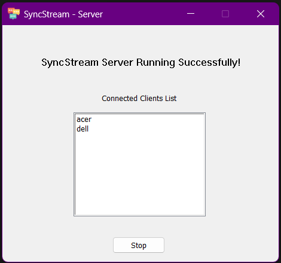
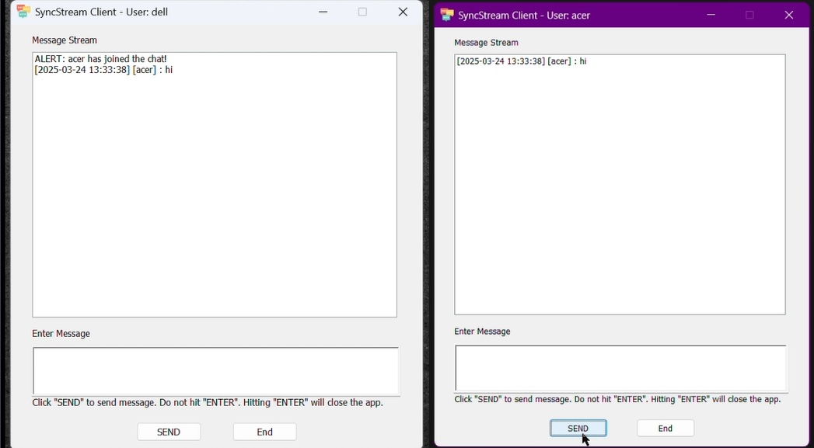
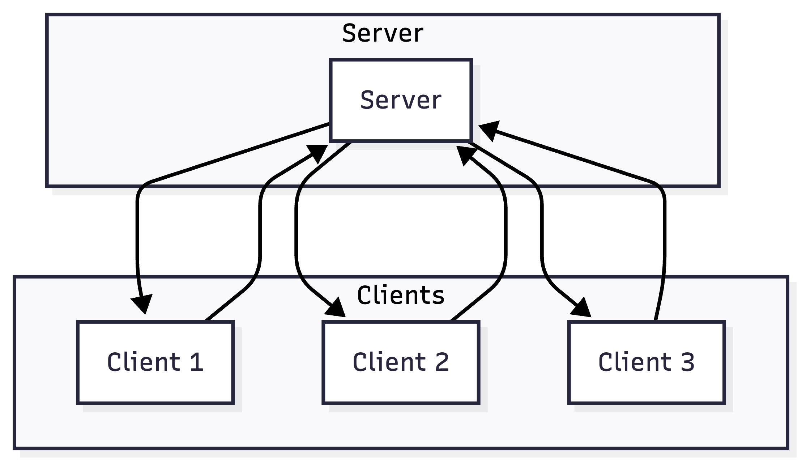
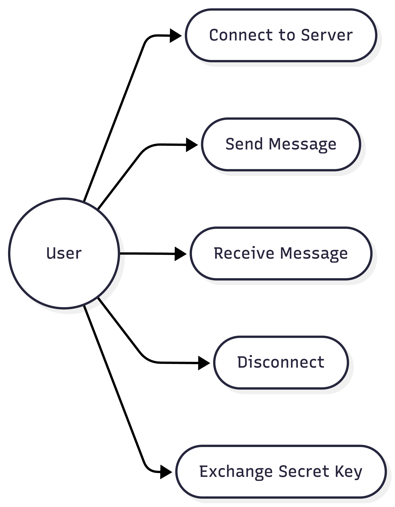
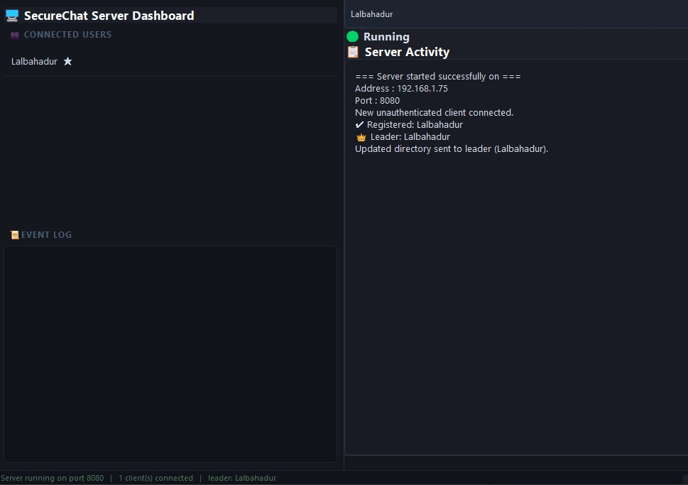
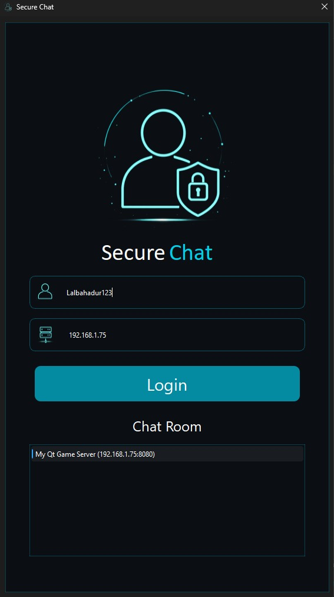
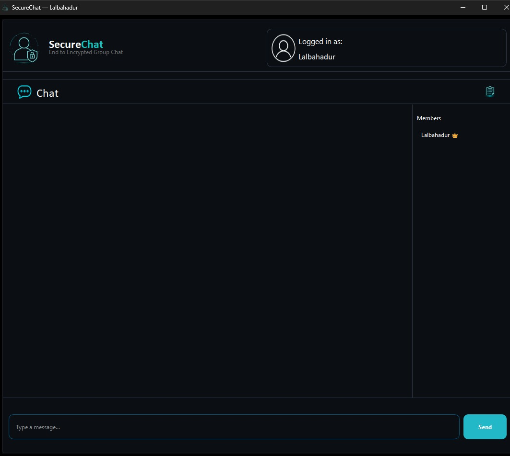
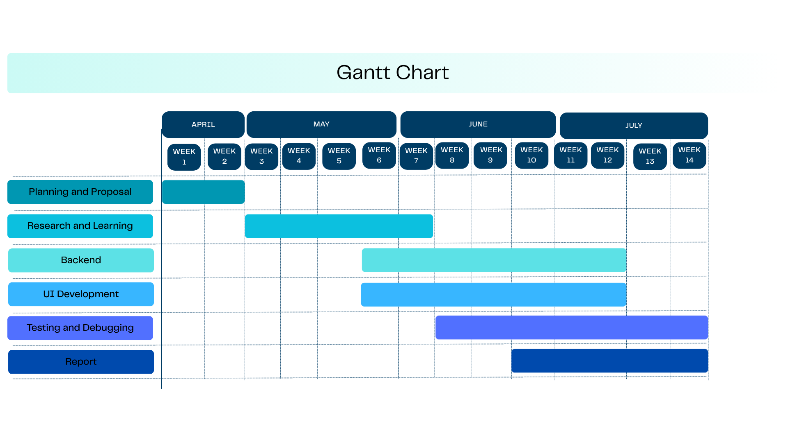

::: {.titlepage}
::: center

**Kathmandu University**

**Department of Computer Science and Engineering**

Dhulikhel, Kavre

<figure id="logo" data-latex-placement="H">

</figure>

**A Project Report**

on

**SecureChat**

A Secure LAN-Based Messaging Application

**Course No.: ENGG 102**

(Submitted in Partial Fulfillment of the Requirements for Year I /
Semester II in Computer Engineering)

**Submitted by**

Maniraj Baral (26)\
Genius Bhandari (34)\
Aayush Bist (43)\
Prajwal Chamlagain (45)\
Pratish Chaudhary (49)

**Submitted to**

Supervisor's Name\
Department of Computer Science and Engineering

July 2026

...

:::
:::

# Abstract {#abstract .unnumbered}

SecureChat is a desktop-based messaging application developed using C++
and the Qt framework. The project follows a client--server architecture
and enables multiple users to communicate over a Local Area Network
(LAN) using TCP sockets.

The application provides real-time messaging through a graphical user
interface while implementing the Diffie--Hellman key exchange algorithm
to establish a shared secret for secure communication. The project
demonstrates practical concepts of computer networking, socket
programming, object-oriented programming, and GUI development.

The SecureChat application was successfully designed, implemented, and
tested. The results show reliable communication between multiple clients
in a LAN environment and provide a strong foundation for future
enhancements such as end-to-end encryption, internet-based
communication, and file sharing.

# Abbreviations {#abbreviations .unnumbered}

  ----- --------------------------------------
  API   Application Programming Interface
  C++   C Plus Plus
  DH    Diffie--Hellman
  GUI   Graphical User Interface
  IDE   Integrated Development Environment
  IP    Internet Protocol
  LAN   Local Area Network
  Qt    Cross-platform Application Framework
  TCP   Transmission Control Protocol
  UI    User Interface
  ----- --------------------------------------

# Introduction

## Background

Communication systems play an important role in modern computing. Most
messaging applications rely on cloud-based services, making it difficult
for students to understand the underlying networking concepts. As a
result, practical knowledge of client--server communication and socket
programming is often limited.

SecureChat is a desktop messaging application developed to provide
hands-on experience with network and secure communication. It enables
users to exchange messages over a Local Area Network (LAN) while
demonstrating the practical implementation of computer networking
concepts.

## Project Overview

SecureChat is a client--server messaging application developed using C++
and the Qt framework. It allows multiple users to communicate in real
time over a local network. The server manages client connections and
sends messages to all connected users. The application also implements
the Diffie--Hellman key exchange algorithm to establish a shared secret
for secure communication.

## Problem Statement

Many commercial messaging applications hide the internal workings of
communication systems behind cloud-based services. This limits students'
practical understanding of networking concepts such as socket
programming, client--server architecture, and secure communication.

The SecureChat project addresses this problem by providing a simple
messaging application that demonstrates these concepts through practical
implementation.

## Scope of the Project

The SecureChat application is designed for communication within a Local
Area Network (LAN). It demonstrates real-time messaging, socket
programming, and basic secure communication. The modular design allows
future enhancements such as internet-based communication, file sharing,
and end-to-end encryption.

## Significance of the Project

This project helps students understand networking concepts through
practical implementation. It provides experience in client--server
programming, GUI development using Qt, and collaborative software
development using Git and GitHub.

## Objectives

The main objectives of the SecureChat project are:

- Develop a desktop-based messaging application.

- Implement client--server communication using TCP sockets.

- Support communication among multiple users.

- Design a user-friendly graphical interface using Qt.

- Implement secure key exchange using the Diffie--Hellman algorithm.

- Provide practical experience in networking and software development.

## Structure of the Report

The report is organized into the following chapters:

- **Chapter 1: Introduction** -- Presents the background, project
  overview, problem statement, objectives, scope, significance, and
  report structure.

- **Chapter 2: Literature Review** -- Discusses the concepts and
  technologies related to the project, including client--server
  architecture, socket programming, TCP/IP, and the Qt framework.

- **Chapter 3: System Analysis and Design** -- Describes the system
  requirements, architecture, major modules, and overall design of the
  SecureChat application.

- **Chapter 4: Implementation** -- Explains the implementation of the
  client, server, graphical user interface, networking, and security
  features.

- **Chapter 5: Testing and Results** -- Presents the testing process,
  test cases, and the results obtained during implementation.

- **Chapter 6: Limitations and Future Enhancements** -- Discusses the
  current limitations of the application and possible future
  improvements.

- **Chapter 7: Conclusion** -- Summarizes the project and the knowledge
  gained during its development.

# Literature Review

## Introduction

This chapter presents the concepts and technologies used in the
development of the SecureChat application. The project combines computer
networking, graphical user interface development, and basic cryptography
to create a secure desktop messaging application. Understanding these
concepts provides the theoretical foundation for the implementation of
the system.

## Client--Server Architecture

Client--server architecture is one of the most widely used communication
models in computer networks. In this model, a central server provides
services while one or more clients request those services. The server
manages client requests, processes data, and returns the appropriate
response. This architecture offers several advantages, including
centralized management, easier maintenance, and support for multiple
users. Since all communication passes through the server, it can
efficiently coordinate message exchange between connected clients.

SecureChat follows the client--server model. The server accepts incoming
client connections, manages active users, and broadcasts messages to all
connected clients, enabling real-time communication.

## TCP/IP Protocol

TCP/IP (Transmission Control Protocol/Internet Protocol) is the standard
protocol suite used for communication over computer networks.

The Internet Protocol (IP) is responsible for identifying devices and
routing data packets across the network. Transmission Control Protocol
(TCP) ensures reliable communication by checking for errors, maintaining
packet order, and retransmitting lost packets when necessary.

Since messaging applications require reliable communication, SecureChat
uses TCP sockets to ensure that messages are delivered accurately and in
the correct order.

## Qt Framework

Qt is a cross-platform application development framework widely used for
developing desktop applications with graphical user interfaces. It
supports Windows, Linux, and macOS.

Qt provides several useful libraries for GUI development, networking,
threading, and event handling. These libraries simplify application
development by providing ready-made classes for common programming
tasks.

SecureChat uses Qt Widgets for building the graphical user interface and
the Qt Network module for implementing TCP communication between the
client and server.

### Qt Socket Programming

Qt provides built-in networking classes that simplify socket programming
and make network application development easier. The two main classes
used in SecureChat are `QTcpServer` and `QTcpSocket`.

`QTcpServer` is responsible for listening to incoming client connections
and accepting connection requests. After a client connects,
communication is handled through `QTcpSocket`, which allows data to be
sent and received over a TCP connection.

Qt also uses the signal and slot mechanism to handle networking events
such as new connections, incoming messages, and client disconnections.
This event-driven approach reduces the complexity of socket programming
and makes the application more responsive.

In SecureChat, Qt socket programming is used to establish communication
between the server and multiple clients. It provides reliable message
transmission, simplifies network management, and integrates smoothly
with the graphical user interface developed using the Qt framework.

### QTcpServer

`QTcpServer` is a Qt class used to create a TCP server. It listens for
incoming client connection requests on a specified IP address and port
number. When a client attempts to connect, the server accepts the
connection and creates a socket for communication. In SecureChat,
`QTcpServer` is responsible for accepting multiple client connections
and managing communication between them.

### QTcpSocket

`QTcpSocket` is a Qt class used for TCP communication between the client
and the server. It establishes a connection, sends messages, and
receives data over the network. The class also detects events such as
successful connections, incoming messages, and client disconnections
through Qt's signal and slot mechanism. In SecureChat, each connected
client communicates with the server using a `QTcpSocket` object.

Together, `QTcpServer` and `QTcpSocket` provide reliable communication
over TCP and simplify the implementation of real-time messaging
applications. Their integration with the Qt framework makes network
programming easier while supporting efficient communication between
multiple clients and the server.

### QUdpSocket

QUdpSocket is a subclass of QAbstractSocket in Qt that enables
asynchronous, lightweight UDP datagram communication for applications
prioritizing speed and low overhead over guaranteed delivery. Working in
a connectionless fashion, it uses bind() to listen on a specified local
address/port and emits a readyRead() signal whenever incoming packets
arrive, which can then be processed with readDatagram() or
receiveDatagram(). In addition to basic unicast transfers using
writeDatagram(), QUdpSocket natively supports IP multicasting and
broadcasting, and it can optionally call connectToHost() to use standard
QIODevice stream methods (read() and write()) aimed at a dedicated
target.

## Diffie--Hellman Key Exchange

Diffie--Hellman is a public key exchange algorithm that enables two
communicating parties to establish a shared secret over an insecure
network.

Instead of directly sending the secret key, both parties exchange public
values and independently calculate the same shared key. Since the secret
itself is never transmitted, the communication becomes more secure.

In SecureChat, the Diffie--Hellman algorithm is used to demonstrate
secure key exchange before communication begins.

# Related Work

## Introduction

Several desktop messaging applications have been developed using
client--server architecture and socket programming. These applications
demonstrate real-time communication and provide a foundation for
understanding network programming.

## Existing Messaging Applications

Applications such as WhatsApp, Telegram, Discord, and Microsoft Teams
provide secure communication over the Internet. They support features
such as instant messaging, media sharing, voice calls, and end-to-end
encryption. However, these systems rely on cloud infrastructure and do
not expose their internal implementation.

## Academic Projects

Many academic networking projects focus on simple chat applications
using TCP sockets. These projects generally implement client--server
communication but often lack graphical user interfaces or secure
communication mechanisms.

Some examples of Academic Projects we came across are:

### SyncStream:

SyncStream is a real-time, multi-user chat application built for
Windows. It allows multiple users to connect to a central server and
broadcast text messages in real time.

<figure id="fig:SyncStream:Server" data-latex-placement="H">

<figcaption>SyncStream:Server</figcaption>
</figure>

<figure id="fig:SyncStream:Client" data-latex-placement="H">

<figcaption>SyncStream:Client</figcaption>
</figure>

## Comparison with SecureChat

SecureChat is designed primarily for educational purposes. It combines
socket programming, GUI development using Qt, and the Diffie--Hellman
key exchange algorithm into a single desktop application. Unlike
commercial applications, it helps students understand the practical
implementation of networking concepts.

## Summary

The study of existing messaging systems and academic projects helped
identify the features required for SecureChat. These ideas were used to
design a simple, modular, and educational messaging application.

# System Analysis and Design

## Introduction

This chapter describes the design and overall structure of the
SecureChat application. It presents the system requirements,
architecture, major modules, and workflow of the application.

## System Requirements

### Hardware Requirements

- Processor: Intel Core i3 or equivalent

- RAM: Minimum 4 GB

- Storage: Minimum 200 MB free space

- Local Area Network (LAN)

### Software Requirements

- Operating System: Windows or Linux

- Qt Framework

- C++ Compiler

- CMake

- Git

## Functional Requirements

The SecureChat application provides the following features:

- Connect clients to the server.

- Exchange messages in real time.

- Support multiple connected users.

- Broadcast messages to all connected clients.

- Perform secure key exchange using Diffie--Hellman.

## Non-Functional Requirements

The system is designed to satisfy the following requirements:

- Reliable communication using TCP.

- Simple and user-friendly interface.

- Fast message transmission.

- Modular and maintainable code structure.

## System Architecture

SecureChat follows a client--server architecture. The server manages all
client connections and message broadcasting. Clients connect to the
server through TCP sockets, perform key exchange, and communicate by
sending and receiving messages over the network.

SecureChat follows a client--server architecture as shown in
Figure [4.1](#fig:architecture){reference-type="ref"
reference="fig:architecture"}. The server accepts client connections,
manages communication, and broadcasts messages to all connected users.

<figure id="fig:architecture" data-latex-placement="H">

<figcaption>System Architecture of SecureChat</figcaption>
</figure>

## Major Modules

The application consists of the following modules:

- **Server Module** -- Accepts client connections and broadcasts
  messages.

- **Client Module** -- Provides the user interface and manages
  communication with the server.

- **Communication Module** -- Handles TCP socket communication between
  the client and server.

- **Security Module** -- Performs the Diffie--Hellman key exchange for
  secure communication.

Figure [4.2](#fig:usecase){reference-type="ref" reference="fig:usecase"}
illustrates the primary interactions between the user and the SecureChat
application.

<figure id="fig:usecase" data-latex-placement="H">

<figcaption>Use Case Diagram of SecureChat</figcaption>
</figure>

## System Workflow

The overall workflow of the SecureChat application is as follows:

1.  Start the server application.

2.  Connect one or more clients to the server.

3.  Perform secure key exchange.

4.  Exchange messages between users.

5.  Broadcast messages to all connected clients.

6.  Disconnect from the server after communication.

# Implementation

## Introduction

This chapter describes the implementation of the SecureChat application.
The project was developed using C++ and the Qt framework based on a
client--server architecture. The implementation consists of separate
client and server applications that communicate through TCP sockets
while providing a graphical user interface for users.

## Development Environment

The application was developed using the following tools:

- Programming Language: C++

- Framework: Qt 6

- IDE: Qt Creator

- Build System: CMake

- Version Control: Git and GitHub

- Operating System: Windows

## Project Structure

The SecureChat project is divided into two main parts:

- Server Application

- Client Application

The server manages all client connections and communication, whereas the
client provides the graphical interface for users to interact with the
system.

## Server Implementation

The server application is responsible for accepting client connections,
managing connected users, and broadcasting messages. It continuously
listens for new client requests and forwards messages to all connected
users.

The server consists of the following components:

- **mainwindow** -- Controls the main server window and manages
  communication.

- **authmanager** -- Handles user authentication and authorization.

- **ServerDiscoveryBeacon** -- Allows clients to discover the server
  automatically within the local network.

## Encryption Implementation

To provide secure communication between clients, SecureChat uses a
combination of the Diffie--Hellman (DH) key exchange algorithm, room key
exchange, and XOR-based encryption. The objective is to ensure that
messages remain confidential even though they are transmitted through
the server. The server only forwards encrypted messages and does not
know their actual contents.

### Key Exchange (Diffie--Hellman)

When a client connects to the server, the server sends two public
parameters: a large prime number ($p$) and a generator ($g$). Each
client then generates its own private key locally using a random 64-bit
integer generator provided by the Qt framework.

Using these values, each client calculates its public key using the
following equation:

$$\text{Public Key} = g^{\text{Private Key}} \bmod p$$

The calculated public key is then sent to the server, which distributes
it to the other connected clients. All calculations are performed using
the `long long` data type to reduce the possibility of precision errors.

### Room Key Generation and Distribution

Instead of encrypting messages directly with the Diffie--Hellman shared
secret, SecureChat generates a separate room key consisting of 26
randomly selected characters. This room key is created once by the room
leader and shared securely with every participant.

For each connected client, the room leader calculates a shared secret
using the following equation:

$$\text{Shared Secret} = (\text{Peer Public Key})^{\text{Leader Private Key}} \bmod p$$

Because of the mathematical properties of the Diffie--Hellman algorithm,
each client independently computes the same shared secret using the
leader's public key and its own private key.

The room leader encrypts the room key by applying the XOR operation with
the shared secret before sending it to each client. The receiving client
performs the same XOR operation using its computed shared secret to
recover the original room key.

### Message Encryption (XOR Cipher)

After all clients obtain the same room key, chat messages are encrypted
using a repeating-key XOR cipher.

The encryption process is represented by:

$$C = P \oplus K$$

where

- $P$ = Plaintext

- $K$ = Room Key

- $C$ = Ciphertext

The original message is recovered using the same operation:

$$P = C \oplus K$$

Since the room key contains only 26 characters, it is repeated
cyclically throughout the message:

$$C[i] = P[i] \oplus K[i \bmod \text{Length}(K)]$$

This method provides a simple demonstration of symmetric encryption for
educational purposes.

### Security Analysis

The Diffie--Hellman private key is generated randomly using a 64-bit
integer, making brute-force attacks computationally difficult.
Similarly, the 26-character room key provides a very large number of
possible combinations, making random guessing highly impractical.

Although the current implementation is intended primarily for
educational purposes, it demonstrates the basic concepts of secure key
exchange and encrypted communication between multiple users.

### Limitations

The current encryption implementation has several limitations:

- The application does not provide forward secrecy across different
  sessions.

- Message integrity and authentication are not implemented.

- The repeating-key XOR cipher is not considered cryptographically
  secure for real-world applications.

- Advanced encryption algorithms such as AES have not been implemented.

## Client Implementation

The client application provides an interactive graphical interface
through which users connect to the server and exchange messages. It
communicates with the server using TCP sockets and updates the interface
whenever new messages arrive.

The client is composed of the following components:

- **Login Window** -- Allows users to enter their credentials and the
  IP-address of the server where the server is hosted before joining the
  chat.

- **Main Window** -- Displays conversations and provides message input.

- **Auth Client** -- Communicates with the server for authentication.

- **Bubble Message** -- Displays chat messages in a user-friendly bubble
  format.

- **System Log Dialog** -- Displays important system messages and logs.

- **Server Discoverer** -- Detects available servers on the local
  network.

## Graphical User Interface

The graphical user interface was developed using Qt Widgets. The
interface includes a login window, chat window, message display area,
and message input field. The design provides a simple and user-friendly
environment for communication.

The GUI updates automatically whenever new messages are received from
the server.

## Networking

Networking is implemented using the Qt Network module. TCP sockets
establish reliable communication between the client and server. The
server listens for incoming connections while multiple clients connect
using the server's IP address and port number.

Once connected, messages are transmitted through the server and
broadcast to all active clients in real time.

## Security Implementation

SecureChat demonstrates secure communication by implementing the
Diffie--Hellman key exchange algorithm. Before communication begins, the
client and server exchange public values and independently generate a
shared secret key.

The project also includes the QtEncryptionEngine module, which provides
encryption-related functionality for secure communication.

## Implementation Workflow

The overall implementation process follows these steps:

1.  Start the server application.

2.  Clients discover or connect to the server.

3.  User authentication is performed.

4.  Diffie--Hellman key exchange establishes a shared secret.

5.  Messages are exchanged between connected users.

6.  The server broadcasts messages to all active clients.

7.  Clients disconnect when communication is complete.

# Testing and Results

## Introduction

This chapter presents the testing carried out on the SecureChat
application. The objective was to verify that the client and server
communicate correctly, messages are delivered successfully, and the
implemented features operate as expected.

## Testing Environment

The application was tested under the following environment:

- Operating System: Windows

- Framework: Qt 6

- Communication Protocol: TCP

- Network: Local Area Network (LAN)

- Multiple client instances connected to a single server

## Test Cases

The following test cases were performed to verify the functionality of
the application.

   **Test ID**  **Description**                                **Result**
  ------------- --------------------------------------------- ------------
      TC-01     Server starts successfully                       Passed
      TC-02     Client connects to server                        Passed
      TC-03     User authentication                              Passed
      TC-04     Message transmission                             Passed
      TC-05     Message broadcasting                             Passed
      TC-06     Multiple clients communicate simultaneously      Passed
      TC-07     Server discovery                                 Passed
      TC-08     Secure key exchange                              Passed

  : Test Cases

## Results

The SecureChat application was successfully implemented and tested.
Multiple clients were able to connect to the server simultaneously and
exchange messages in real time. The server correctly broadcast messages
to all connected clients.

Figure [6.1](#fig:serverdashboard){reference-type="ref"
reference="fig:serverdashboard"} shows the server dashboard during
execution.

<figure id="fig:serverdashboard" data-latex-placement="H">

<figcaption>Server Dashboard</figcaption>
</figure>

The authentication mechanism worked as expected, and users were able to
join the chat room successfully using the login interface.

Figure [6.2](#fig:loginwindow){reference-type="ref"
reference="fig:loginwindow"} shows the client login window.

<figure id="fig:loginwindow" data-latex-placement="H">

<figcaption>Client Login Window</figcaption>
</figure>

After successful login, users entered the chat room where messages could
be exchanged in real time. The member list and chat interface were
updated correctly during communication.

Figure [6.3](#fig:chatwindow){reference-type="ref"
reference="fig:chatwindow"} shows the SecureChat main chat window.

<figure id="fig:chatwindow" data-latex-placement="H">

<figcaption>SecureChat Main Chat Window</figcaption>
</figure>

The Diffie--Hellman key exchange was successfully performed before
communication, and automatic server discovery simplified the connection
process within the local network.

# Project Planning and Management

## Introduction

Proper planning and management were essential for the successful
completion of the SecureChat project. The project was divided into
several phases to ensure systematic development and timely completion.

## Project Development Phases

The project was completed through the following phases:

- Requirement Analysis

- System Design

- GUI Development

- Client and Server Implementation

- Diffie--Hellman Integration

- Testing and Debugging

- Documentation

## Gantt Chart

Figure [7.1](#fig:gantt){reference-type="ref" reference="fig:gantt"}
illustrates the project schedule followed during development.

<figure id="fig:gantt" data-latex-placement="H">

<figcaption>Project Gantt Chart</figcaption>
</figure>

## Team Responsibilities

  **Member**           **Responsibility**
  -------------------- -------------------------------------------
  Maniraj Baral        GUI development and functionality testing
  Genius Bhandari      Security module and integration
  Aayush Bist          Documentation and testing
  Prajwal Chamlagain   Client module development and GUI testing
  Pratish Chaudhary    Server implementation and networking

  : Division of Work Among Team Members

## Summary

This chapter presented the project planning and management activities
carried out during the development of SecureChat. It described the
different phases of the project, the responsibilities assigned to each
team member, and the development schedule through the Gantt chart.

Proper planning, task distribution, and teamwork helped ensure that the
project was completed systematically and within the planned time.
Effective coordination among team members also contributed to the
successful implementation and documentation of the SecureChat
application.

# Limitations and Future Enhancements

## Introduction

Although the SecureChat application successfully provides secure
communication over a Local Area Network (LAN), it has certain
limitations. This chapter discusses the current limitations of the
system and suggests possible enhancements for future development.

## Limitations

The current version of SecureChat has the following limitations:

- The application works only within a Local Area Network (LAN).

- File and media sharing are not supported.

- Group management features such as creating or deleting chat groups are
  not available.

- User accounts are limited to the implemented authentication mechanism.

- Message history is not permanently stored after the application is
  closed.

- The application is primarily designed for desktop platforms.

## Future Enhancements

The following improvements can be made in future versions of the
application:

- Support communication over the Internet instead of only LAN.

- Implement end-to-end encryption for enhanced security.

- Add file, image, and document sharing.

- Store chat history in a database.

- Support voice and video communication.

- Improve group chat management features.

- Add push notifications and status indicators.

- Develop mobile versions of the application for Android and iOS.

  ## Summary

  The current implementation of SecureChat demonstrates the fundamental
  concepts of networking, client--server communication, and secure key
  exchange. With additional features such as internet support,
  multimedia sharing, and enhanced security, the application can be
  further developed into a more complete messaging platform.

# Conclusion and References

## Conclusion

The SecureChat project successfully achieved its main objective of
developing a desktop-based messaging application using C++ and the Qt
framework. The application enables multiple users to communicate over a
Local Area Network (LAN) through a client--server architecture using TCP
sockets.

The project also demonstrated the use of the Diffie--Hellman key
exchange algorithm for secure communication and provided practical
experience in networking, GUI development, and software engineering.
Overall, SecureChat met the intended objectives and serves as a strong
foundation for future enhancements such as end-to-end encryption, file
sharing, and internet-based communication.

## References

1.  Bjarne Stroustrup. *The C++ Programming Language (4th Edition)*.
    Addison-Wesley Professional, 2013.

2.  Qt Documentation. Available: <https://doc.qt.io/>

3.  Qt Network Module Documentation. Available:
    <https://doc.qt.io/qt-6/qtnetwork-index.html>

4.  CMake Documentation. Available: <https://cmake.org/documentation/>

5.  Git Documentation. Available: <https://git-scm.com/doc>

6.  GitHub Documentation. Available: <https://docs.github.com/>

7.  Academic Project - SyncStream by yadunand-kamath. Available:
    <https://github.com/yadunand-kamath/SyncStream>

8.  Deffie-Hellman Key Exchange Available:
    <http://geeksforgeeks.org/computer-networks/implementation-diffie-hellman-algorithm/>

9.  GitHub Documentation. Available: <https://docs.github.com/>

10. XOR Cipher. Available:
    <https://www.geeksforgeeks.org/dsa/xor-cipher/>

11. QUdpSockets. Available: <https://doc.qt.io/qt-6/qudpsocket.html>
